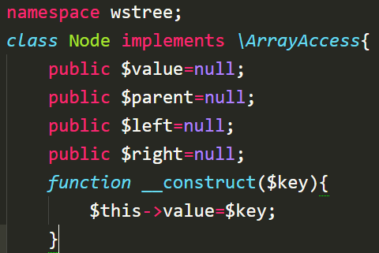
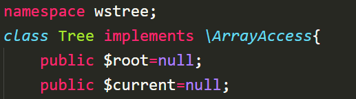

# PHP 二叉树 类实现

> 该类 仅实现普通的二叉树 

```
    // 安装使用如下
    git clone git@github.com:wschat/tree.git
    cd tree
    composer dump-autoload
```


* [Demo 演示](./demo/)
* [Node 类演示代码testNode.php](./demo/testNode.php)
* [Tree sort辅助排序类演示代码testSort.php](./demo/testSort.php)
* [Tree insert插入操作方法演示代码testTreeInsert.php](./demo/testTreeInsert.php)
* [Tree tree()、left()、end()、closest()、树生成方法演示代码testTree.php](./demo/testTree.php)
* [Tree init()方法使用 多项插入方法演示代码testTreeLimit.php](./demo/testTreeInit.php)
* [Tree 统计、遍历方法演示代码testTreeOrder.php](./demo/testTreeOrder.php)

### 文档完善 （注：Node、Tree 均实现了ArrayAccess接口）

* 关于Node实例类的结构如下：



* 关于Tree实例类的结构如下：
    * $root 包含当前树的根节点
    * $current 包含当前树的指针（目前指针仅在于tree()、leaf()、end()方法中使用）




```
           A
          / \
         B   C
（图2）     /  \
           D    E
          / \  /
         G  H  F
```
##### init($array,$options=[],$parent=null) 快速的生成一个二叉树（图2）为例
    * array $array 用户数据
    * array $options 额外参数 [$pid=0,$sort=true,$pidKey='pid',$level=0];
        * integer $pid      起始pid值
        * boolean $sort     是否先进行按主键值的排序
        * string  $pidKey   指向父级的键名
        * integer $level    级别默认为0 $array每一项均注入一个字段_level起始值为$level+1 如图2：A:1 D:3


```
$data=[
    ['id'=>1,'name'=>'A','pid'=>0],
    ['id'=>2,'name'=>'B','pid'=>1],
    ['id'=>3,'name'=>'C','pid'=>1],
    ['id'=>4,'name'=>'D','pid'=>3],
    ['id'=>5,'name'=>'E','pid'=>3],
    ['id'=>6,'name'=>'F','pid'=>5],
    ['id'=>7,'name'=>'G','pid'=>4],
    ['id'=>8,'name'=>'H','pid'=>4],
];
shuffle($data); // 这只是打乱数组
$tree=new \wstree\Tree();
$tree->init($data);
print_r($tree['root']); // print_r($tree->root);

```


##### 如果想更灵活的组合二叉树 tree($key)、leaf(key)、end()、closest($childNums=2)、可以帮到你（根节点：Tree::$root、指针：Tree::$current）
    * tree($key) 将$node=new Node($key)插入树中(从左到右)，指针指向(当前)$node，如果树没有根节点则第一个插入的Node实例设为根节点
    * leaf($key) 将$node=new Node($key)插入树中(从左到右)，指针指向(上级)$node->parent，如果树没有根节点则直接执行tree($key)
    * end()
    * closest($childNums=2) 将指针指向最近的可插入节点的节点（如果均不满足则返回根节点）当然你也可以多次使用end()方法代替 $childNums 默认为2 可选1、2 。（如果你想使用其它也不影响使用）

```
                        A
                    /       \
                  B          C
（图3）          /  \        /  \
               I    J       D    E
              / \   / \    / \   /
             k   L  M  N   G  H  F
```

* 如（图3）我们实现一个更复杂的实例

```
$tree
    ->tree('A')
        ->tree('B')
            ->tree('I')
                ->leaf('K')
                ->leaf('L')
                ->end()
            ->tree('J')
                ->leaf('M')
                ->leaf('N')
                ->closest(2) //这里使用了 closest() 将指针指向了A（因为上述每一个节点都有了2个子集）
        ->tree('C') //如果你觉得有点乱 其实到这一步 我们已经使用了所有的方法
            ->tree('D')
                ->leaf('G')
                ->leaf('H')
                ->end()
            ->tree('E')
                ->leaf('F');
print_r($tree['root']);
```

##### preOrder($node,$callback) 先序遍历
    * Node $node 一个节点(当然这个节点必须存在于Tree中)
    * function $callback 回调函数(允许匿名) 参数为遍历的节点

```
// 这是一个扩展的功能 $count => 8
$count=null;
// $tree 来源（图2）
$tree->preOrder($tree['root'],function($item)use(&$count){
    echo $item['value']['name'];
    $count++;
});
// 输出：ABCDGHEF

```

##### inOrder($node,$callback) 中序遍历
    * Node $node 一个节点(当然这个节点必须存在于Tree中)
    * function $callback 回调函数(允许匿名) 参数为遍历的节点

```
// $tree 来源（图2）
$tree->inOrder($tree['root'],function($item){
    echo $item['value']['name'];
});
// 输出：BAGDHCFE

```

##### postOrder($node,$callback) 后序遍历
    * Node $node 一个节点(当然这个节点必须存在于Tree中)
    * function $callback 回调函数(允许匿名) 参数为遍历的节点

```
// $tree 来源（图2）
$tree->postOrder($tree['root'],function($item){
    echo $item['value']['name'];
});
// 输出：ABCDGHEF

```

##### levelOrder($node,$callback) 层层遍历
    * Node $node 一个节点(当然这个节点必须存在于Tree中)
    * function $callback 回调函数(允许匿名) 参数为遍历的节点
    * $callback的参数与另三个遍历参数有区别(会返回空节点 null )

```
// $tree 来源（图2）
$tree->levelOrder($tree['root'],function($item){
    echo '<br>'.$item['value']['name'];
});
// 输出：
A
B
C
null
null
D
E
G
H
F
null
null
null
null
null
```

##### boolean isFull($node=null) 是否满二叉树
    * $node 默认为根节点

```
// $tree 来源（图2）
echo $tree->isFull($tree->root); //$tree->isFull();
```

##### boolean isComplete($node=null) 是否完全二叉树
    * $node 默认为根节点

```
// $tree 来源（图2）
echo $tree->isComplete($tree->root); //$tree->isComplete();
```

##### integer getDepth($node) 获取当前节点深度 根节点深度为 1
    * $node 节点

```
// $tree 来源（图2）
echo $tree->getDepth($tree->root); // 1;
```

##### integer getHeight($node) 获取当前节点高度(最大高度) 叶节点高度为 1
    * $node 节点

```
// $tree 来源（图2）
echo $tree->getHeight($tree->root); // 4;
```

##### integer getMinHeight($node) 获取当前节点高度(最小高度) 叶节点高度为 1
    * $node 节点

```
// $tree 来源（图2）
echo $tree->getMinHeight($tree->root); // 2;
```

### 以下是关于两个insert方法在特定情况下的使用 （落位弱区 如（图4）是一个在A下插入子节点的操作）

```
           A                A                A                   A
          / \              / \             /   \               /   \  
         B   C     =>     B   C     =>    B     C     =>      B     C
（图4） /                /    /          /  \   /            /  \   / \
      D                D    E          D    F  E            D   F  E   G
```

##### insertable($node,$natural=false) 查询可插入的节点信息(公排|弱区落位)
    * $node 需要在该节点下插入 不一定是根节点 $node必须存在于树中
    * $natural false：弱区落位  true：公排（从上到下做到右 类似levelOrder()）

```
// $tree 来源（图2）
$parent=$tree->insertable($tree['root']); // B
$parent=$tree->insertable($tree['root']['left']); // B
$parent=$tree->insertable($tree['root']['right']); // E
```

##### insert($key,$node=null,$natural=false) 插入新节点(公排|弱区落位)
    * $key 需要插入的值
    * $node 需要在该节点下插入 不一定是根节点 $node必须存在于树中
    * $natural false：弱区落位  true：公排（从上到下做到右 类似levelOrder()）
    * 返回新增的节点，这只是在insertable()方法的基础上进行自我判断并插入操作

```
// $tree 来源（图2）
$result=$tree->insert('I',$tree['root']);
```

### 三个扩展方法 childrens()、 levelSort()、preSort()、

##### childrens($array,$pidKey='pid') 子集个数统计（直属下级），注入每一项_childrens字段(init() 中使用到)
    * array $array 一个有特定规律的二维数组
    * string $pidKey 指向父级的键名
```
// 注：以下的另两个方法均以该数据为例
$data=[
    ['id'=>1,'name'=>'A','pid'=>0],
    ['id'=>2,'name'=>'B','pid'=>1],
    ['id'=>3,'name'=>'C','pid'=>1],
    ['id'=>4,'name'=>'D','pid'=>3],
    ['id'=>5,'name'=>'E','pid'=>3],
    ['id'=>6,'name'=>'F','pid'=>5],
    ['id'=>7,'name'=>'G','pid'=>4],
    ['id'=>8,'name'=>'H','pid'=>4],
];
$result=Tree::childrens($data,'pid');
```

##### preSort($array,$pidKey='pid') 先序 排序 以及是否存在子集判断（增加_level字段 深度 0 起始。 getDepth()方法为 1 起始）
    * array $array 一个有特定规律的二维数组
    * string $pidKey 指向父级的键名
```
shuffle($data);
$result=Tree::_childrens($data,'pid'); // _prefix 以_level基准填充8倍的&nbsp;
```
